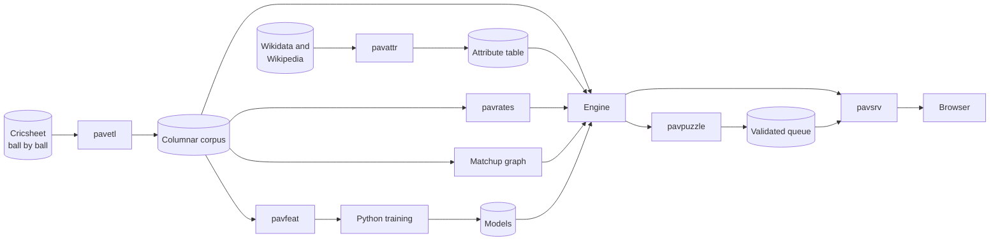

# Pavilion

A daily T20 cricket puzzle. One target score per day, identical for every player
in the world. You play both innings of that target: first you defend it with
five bowlers and a four over limit each, then you chase it with a budget of six
attacking overs.

The puzzle counts as solved only when both halves are won.

Pavilion is scored on decisions rather than outcomes. Every choice is compared
against the alternatives that were available at the moment it was made, before
the ball was bowled, so a well played defeat can outscore a lucky win.

**Status:** feature complete and running locally. Start it with `make serve` and
open <http://127.0.0.1:8080>.

---

## Contents

- [Quick start](#quick-start)
- [Configuration](#configuration)
- [How the game works](#how-the-game-works)
- [Architecture](#architecture)
- [Repository layout](#repository-layout)
- [Data sources and licensing](#data-sources-and-licensing)
- [Attribution](#attribution)
- [Legal](#legal)
- [Development](#development)

---

## Quick start

Pavilion needs a corpus, a fitted rate table and two trained models before it
can serve a puzzle. The pipeline is reproducible from public data and each step
is a Make target.

```sh
make data      # download the Cricsheet IPL archive and the people register
make etl       # build the binary corpus and the data quality report
make attrs     # resolve batting handedness and bowling type
make rates     # fit the hierarchical shrunk player rates
make graph     # build the batter versus bowler matchup graph
make features  # export the training matrix
make model     # train and calibrate the models (requires uv)
make check     # fail if data quality has regressed
make puzzles   # generate and validate the daily puzzle queue
make serve     # run the game on http://127.0.0.1:8080
```

`make model` needs [uv](https://github.com/astral-sh/uv). Everything else is Go
with no cgo, so the server is a single static binary.

### Asking the corpus questions

```sh
go run ./cmd/pavquery dist -bowler "JJ Bumrah" -phase death -vs-hand LHB
go run ./cmd/pavquery matchup -batter "V Kohli" -bowler "JJ Bumrah"
go run ./cmd/pavquery worst -batter "N Pooran"
```

---

## Configuration

Copy `.env.example` to `.env` and fill it in. The server reads plain environment
variables and does not parse `.env` itself, so load it into your shell however
you prefer.

| Variable | Required | Default | Purpose |
| --- | --- | --- | --- |
| `PAVILION_SECRET` | Before public deployment | a development value, with a warning | Master secret. Every day's deliveries are derived from it. |
| `PAVILION_ADDR` | No | `127.0.0.1:8080` | Listen address. |

`PAVILION_SECRET` is the one setting that matters for correctness rather than
convenience. Each day's key is derived from it, and with the key and the model a
client could compute every ball of the day before making a single decision.
Generate one with `openssl rand -hex 32`. Starting without it logs a warning and
uses a development default, which is fine on a laptop and unacceptable anywhere
else.

---

## How the game works

### The daily target is solved, not chosen

Overnight, a generator simulates thousands of full games at candidate targets
and keeps only situations where a competent player wins between 35 and 65
percent of the time **and** where the bowling choice measurably changes the
result. A target you would win nine times in ten is not a puzzle. The search
covers the whole tuple of target, attack, chasing side and venue, because the
attack you are dealt is part of the problem rather than set dressing.

### Randomness is pre committed

The dice are not rolled when you click. Every ball of the day has a fixed
coordinate of day, innings, over and delivery, and its random number is derived
from the day's key plus that coordinate. Ball four of over twelve carries the
same number whether you reach it or not, so replaying cannot fish for a better
outcome and every player genuinely meets the same deliveries.

Your choices move the probabilities, not the dice. A better bowler shifts the
outcome distribution; the same random number is then read against the shifted
distribution.

### Scoring rates decisions

Summing win probability changes across an innings telescopes to the final
result, which measures luck. Instead, before each ball, the engine evaluates
every option that was available and scores you on the gap between what you chose
and the best alternative. A careful player who loses can score positively.

---

## Architecture

Two documents describe the system in detail:

- **[System architecture](docs/system-architecture.md)**: the components, the
  request and data flows, the trust boundary, and the runtime model.
- **[Technical architecture](docs/technical-architecture.md)**: the corpus
  format, the statistical model, the simulator, determinism, and the decisions
  behind each.

The short version:



Three properties are load bearing and are enforced by tests:

1. **Randomness is pre committed from ball coordinates**, never drawn from a
   sequential stream.
2. **The server is authoritative.** The browser sends a choice and renders a
   result. It never simulates a delivery and never receives the day's key.
3. **The daily target is chosen by Monte Carlo**, offline, never at request
   time.

---

## Repository layout

```
cmd/            Command line entry points
  pavetl        Cricsheet archive to binary corpus
  pavattr       Batting hand and bowling type resolution
  pavrates      Hierarchical shrunk rate fitting
  pavfeat       Training matrix export
  pavquery      Corpus queries
  pavpuzzle     Daily puzzle generation and validation
  pavplay       Terminal client
  pavsrv        The game server
internal/
  corpus        Columnar delivery store and aggregation
  attr          Player attributes and normalisation
  rates         Empirical Bayes shrinkage
  graph         Batter versus bowler matchup graph
  features      Feature extraction with an expanding window
  model         Pure Go inference for the trained models
  sim           Deterministic delivery simulator
  engine        Prediction, intent, puzzle construction, ratings
  puzzle        Monte Carlo validation and the daily queue
  session       Signed run tokens and anti replay
  store         Results database
  api           HTTP handlers
web/            Templates and static assets
ml/             Python training, pinned with uv
data/           Inputs, generated artifacts and models
docs/           Architecture documentation
```

---

## Data sources and licensing

### Ball by ball data

All deliveries come from [Cricsheet](https://cricsheet.org), compiled by Stephen
Rushe, under the **Open Data Commons Attribution License 1.0 (ODC-BY 1.0)**:
<http://opendatacommons.org/licenses/by/1.0/>

> **This requires a human re-check before any public launch.** The ODC-BY 1.0
> statement appears on <https://cricsheet.org/register/> and only there. It is
> absent from the downloads page, from the JSON format documentation and from
> the site homepage; all three were checked. A licence stated in exactly one non
> obvious place is worth confirming with the maintainer directly.

ODC-BY is an attribution only licence rather than a share alike one. Derived
databases and models may be distributed under terms of our choosing provided
Cricsheet is attributed. There is no copyleft obligation on the corpus, the
trained models or the game.

### Player attributes

Batting handedness and bowling type come from English Wikipedia, resolved
through Wikidata property P2697, and are therefore **CC BY-SA 4.0**, which is
share alike. This differs from the Cricsheet position and matters: the attribute
table is a derived work of Wikipedia text and carries a share alike obligation,
whereas the ball by ball corpus does not. The two are kept in separate files so
the obligation stays scoped to `data/attributes/` rather than spreading to the
corpus or the models.

ESPNcricinfo is deliberately **not** used. Its `robots.txt` returns 403 to non
browser clients, `www.espn.com/robots.txt` disallows `anthropic-ai` entirely,
and the Disney terms of use prohibit accessing the site by automated means or
contributing to any collection of data or database.

---

## Attribution

Both sources are credited in the application footer and in every generated
artifact. The required text is:

> Ball by ball data from **Cricsheet** (cricsheet.org), by Stephen Rushe, used
> under ODC-BY 1.0. Player attributes from **Wikipedia**, used under CC BY-SA
> 4.0. An unofficial fan project, not affiliated with the BCCI or the IPL.

---

## Legal

An unofficial fan project, not affiliated with, endorsed by, or connected to the
BCCI, the IPL, or any franchise.

Player names are used as factual data. Team names are used nominatively, as a
statement of where a player played, and club colours appear only as a subdued
tint on a card edge or a stand. **No crests, wordmarks, kit designs or other
franchise marks are reproduced anywhere**, and no page is styled to resemble an
official club product. No player photographs are used; players are represented
by initials set in the interface typeface.

---

## Development

```sh
make test     # go test ./...
make vet      # go vet ./...
make check    # data quality gate
make dev      # serve with assets read from disk, so a refresh picks up edits
```

The test suite covers the properties that are easy to break silently:

- randomness is derived from coordinates and does not depend on play order
- the attacking budget binds both sides equally
- a full length innings never serialises a null where an array is expected
- the bowler scheduler can always complete twenty overs
- training features never contain the ball being predicted
- Go and Python inference agree on fixed parity fixtures
- the leaderboard ranks solved runs above unsolved ones

### Requirements

- Go 1.27 or later
- [uv](https://github.com/astral-sh/uv), for model training only

The server has no cgo dependency. SQLite is `modernc.org/sqlite`, a pure Go
implementation, and model inference is a hand written tree evaluator rather than
ONNX or a C library.
