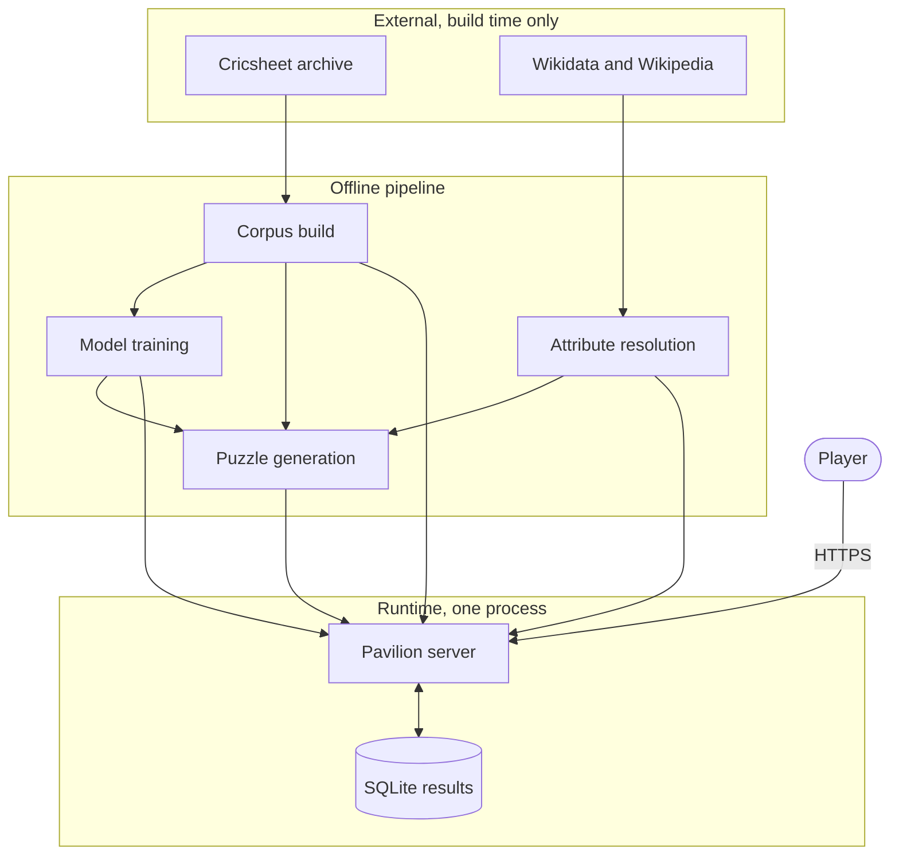
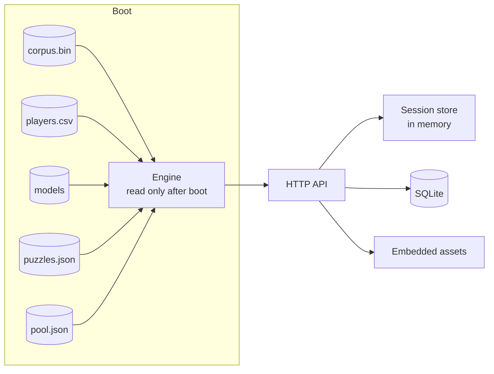
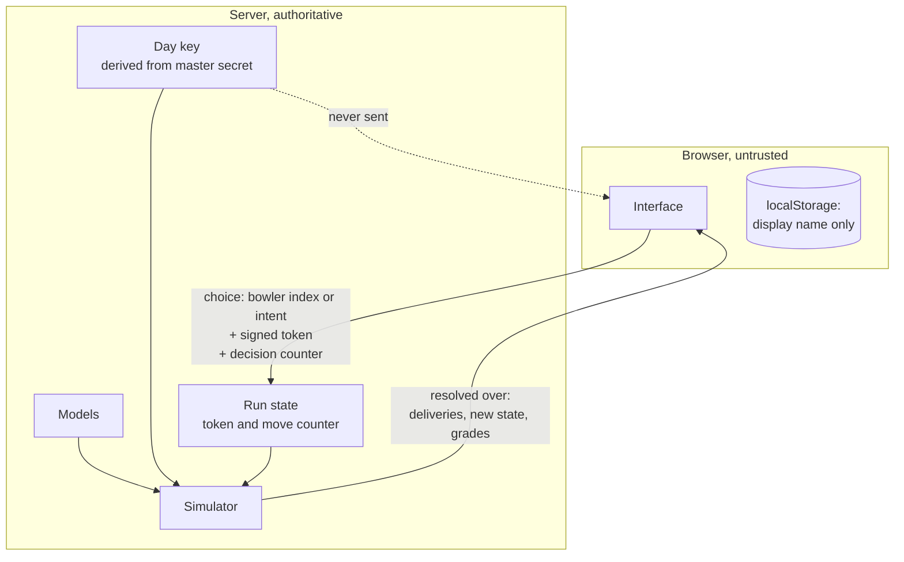
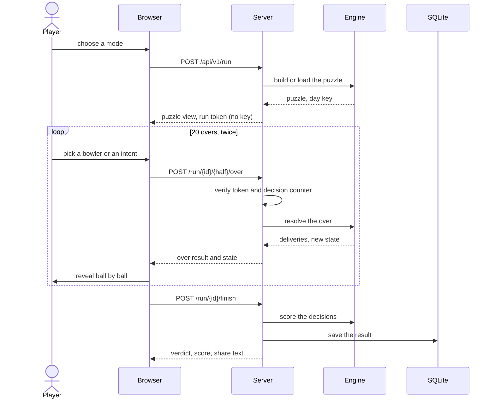
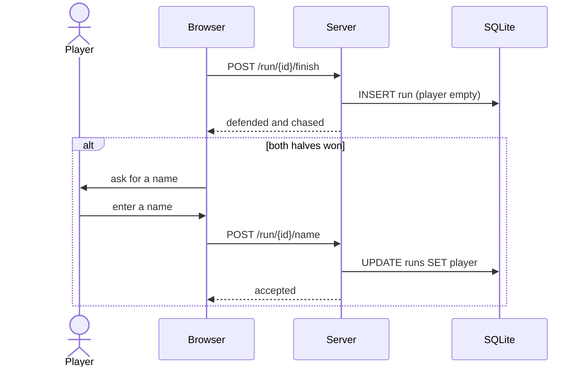
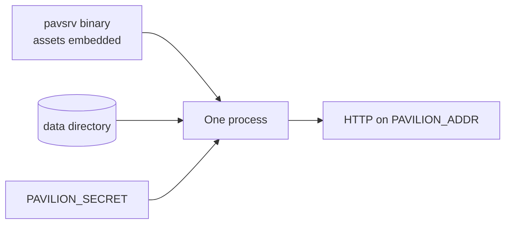

# Pavilion: system architecture

This document describes what the parts of Pavilion are, how they communicate,
and where the trust boundary sits. For the internals of each part, see
[technical-architecture.md](technical-architecture.md).

---

## 1. Context

Pavilion is a single player daily puzzle served from one process. It has no
external runtime dependencies: no database server, no cache, no message broker,
no third party API on the request path. Everything it needs is either compiled
into the binary or read from disk at boot.

The offline pipeline runs on a developer machine or in CI. Nothing it does
happens while a player is waiting.

---

## 2. Components

| Component | Responsibility | Lifetime |
| --- | --- | --- |
| `pavetl` | Convert the Cricsheet JSON archive into a columnar binary corpus | Build |
| `pavattr` | Resolve batting hand and bowling type, with provenance | Build |
| `pavrates` | Fit hierarchical shrunk per player rates | Build |
| `pavfeat` | Export the training matrix with an expanding window | Build |
| `ml/` | Train and calibrate the outcome and win probability models | Build |
| `pavpuzzle` | Search for and validate daily puzzles by Monte Carlo | Build |
| `pavsrv` | Serve the game | Runtime |
| `pavquery`, `pavplay` | Corpus inspection and a terminal client | Development |

### Runtime composition

Everything expensive happens once, at boot. After that the engine is read only,
so requests share it without locking and a decision costs a few milliseconds.

---

## 3. The trust boundary

This is the most important diagram in the system. The browser is untrusted. It
sends a choice and renders a result; it never simulates a delivery, and it never
receives the day's key.

If the key reached the client, the whole game would be solvable offline: with
the key and the model, every ball of the day could be computed before a single
decision was made.

### Anti replay

Each run carries an HMAC signed token and a monotonic decision counter. A
request that repeats a counter value is rejected, so a player cannot replay an
over whose result they disliked.

---

## 4. Request flows

### Starting and playing a run

### Claiming a place on the leaderboard

A name is requested only once the puzzle is solved, which is necessarily after
the result has been recorded, so it is attached afterwards.

The run identifier is a random value known only to the session that played the
run, so holding it is what entitles a caller to name it.

---

## 5. Modes

| Mode | Puzzle source | Counts towards the day | Squad |
| --- | --- | --- | --- |
| Daily | Validated queue for today's date | Yes | Dealt |
| Practice | Validated pool, drawn at random | No | Dealt |
| Pick your XI | Target and ground drawn freely | No | Chosen, within budget |

Daily is kept separate from the other two so that shared statistics mean
something. Practice draws from a pre validated pool so it is instant while still
being balance checked. Pick your XI draws its situation freely, because the
pool's guarantee covers a whole tuple including the attack, and that mode
discards the attack.

---

## 6. Storage

| Store | Contents | Durability |
| --- | --- | --- |
| `corpus.bin` | Every delivery, columnar | Build artifact, reproducible |
| `players.csv` | Attributes with provenance | Checked in |
| `models/` | Trained trees and calibration | Build artifact |
| `puzzles.json` | Validated daily queue | Checked in |
| `pool.json` | Validated practice situations | Checked in |
| `pavilion.db` | Finished runs | Local, gitignored |
| Session store | Runs in progress | Memory, expires after six hours |

A run in progress lives only in memory. This is deliberate: it is a few minutes
of state, and losing it costs a player one puzzle rather than corrupting a
record. Finished runs go to SQLite.

---

## 7. Failure behaviour

| Failure | Behaviour |
| --- | --- |
| No validated puzzle for today | Generate one unchecked, flag it in the interface |
| No practice pool | Practice mode reports itself unavailable |
| Model files missing | Boot fails loudly rather than serving a broken game |
| Database unavailable | Play continues; results are not recorded |
| WebGL or module load failure in the browser | Ground drawing is skipped, the puzzle is unaffected |
| Reduced motion preference | Every animation is disabled |

The general rule is that the puzzle is the product. Anything decorative degrades
to nothing rather than blocking play.

---

## 8. Deployment

The server is a single static binary with the web assets embedded. It needs a
data directory and one environment variable.

Asset URLs carry a content hash, so a changed file is a changed URL and a cached
copy can never be paired with a page that expects a different one.
