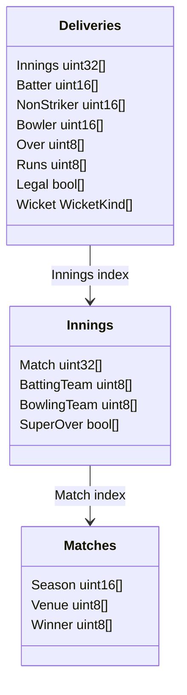
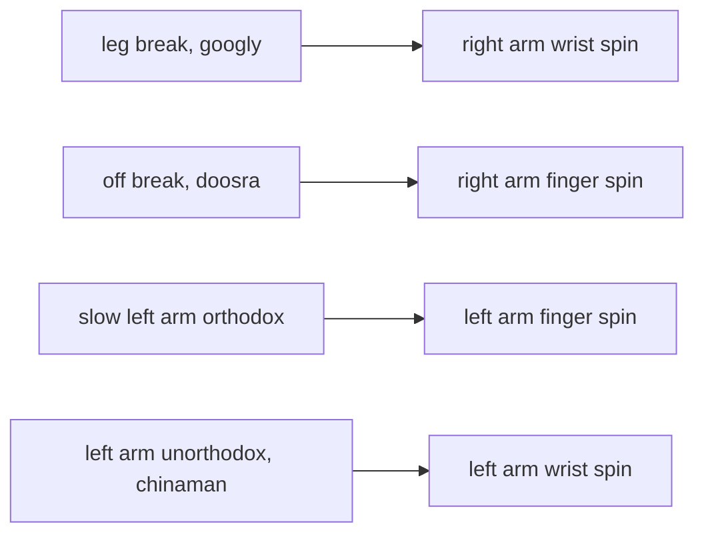
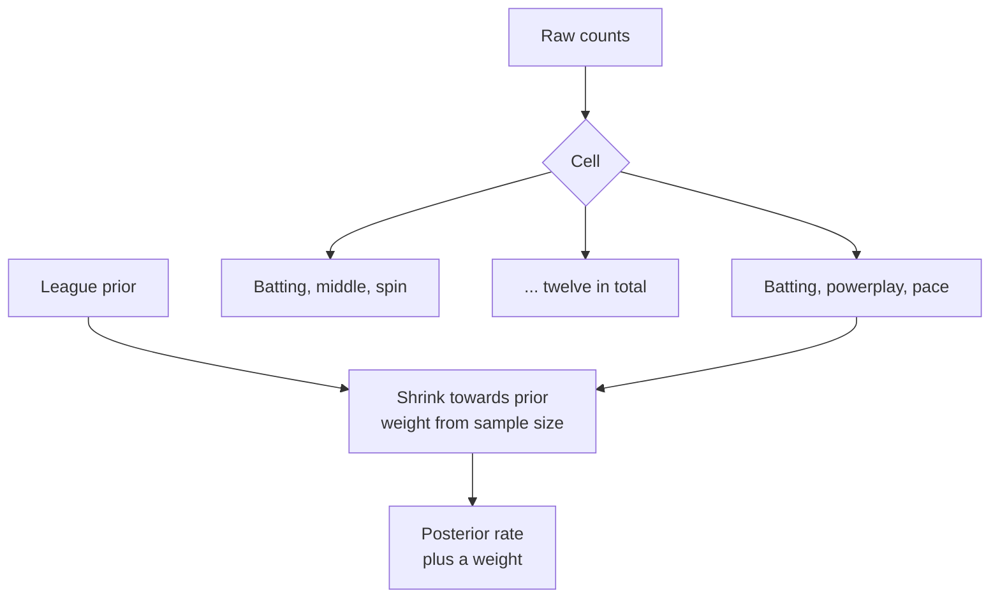
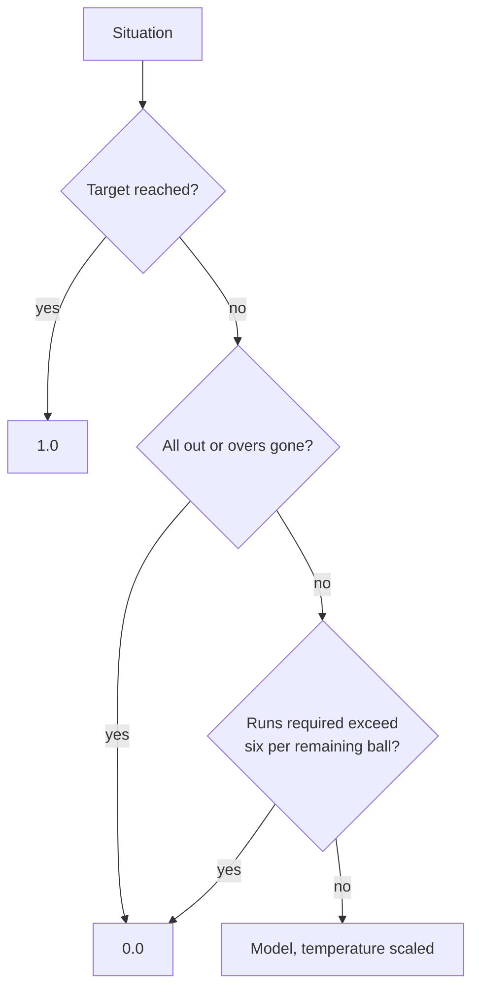
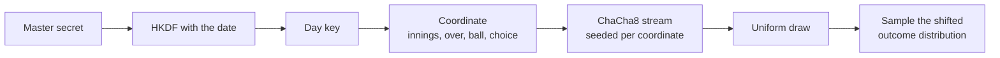
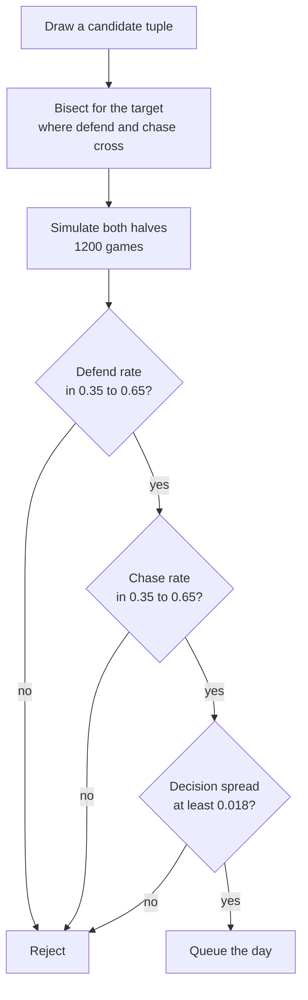
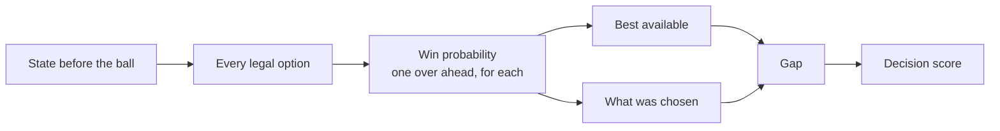

# Pavilion: technical architecture

This document covers how the parts work rather than what they are. For
components and flows, see [system-architecture.md](system-architecture.md).

---

## Contents

1. [The corpus](#1-the-corpus)
2. [Player attributes](#2-player-attributes)
3. [Shrunk rates](#3-shrunk-rates)
4. [Batting order](#3a-batting-order)
5. [The matchup graph](#4-the-matchup-graph)
6. [Features and leakage](#5-features-and-leakage)
7. [The models](#6-the-models)
8. [Determinism](#7-determinism)
9. [The simulator](#8-the-simulator)
10. [Intent and balance](#9-intent-and-balance)
11. [Puzzle generation](#10-puzzle-generation)
12. [Decision scoring](#11-decision-scoring)
13. [The client](#12-the-client)

---

## 1. The corpus

Roughly 260,000 deliveries are stored as a struct of arrays rather than an array
of structs. Aggregation is a linear scan over a few hot columns, which at this
size costs single digit milliseconds, so there is no index and no query planner.



The encoding is a hand written little endian column codec. It is not a general
serialisation format and does not try to be: the corpus is written by one
program and read by one program, both in this repository.

Super over innings are excluded from every aggregate. A one over shootout has
nothing in common with the phase structure the game models and would distort
death overs rates in particular.

---

## 2. Player attributes

The model needs batting handedness and bowling type. Cricsheet does not carry
them, so they are resolved from Wikidata property P2697, which maps a Cricsheet
person identifier to a Wikipedia article, and then from the article itself.

Every row records where its value came from:

| Provenance | Meaning |
| --- | --- |
| `sourced` | Read from Wikipedia, or implied by cricket terminology |
| `manual` | Entered by hand after review |
| `inferred` | Guessed from delivery signatures |

Inferred values never enter the main table. They are written to a separate
review file, because a guessed attribute that looks like a fact is worse than a
missing one.

Some mappings are terminology rather than inference and are therefore treated as
sourced. There is no such thing as a left arm leg break: the term itself fixes
the arm.



Players whose attributes cannot be sourced are excluded from the dealable set
rather than guessed at.

---

## 3. Shrunk rates

A bowler with thirty balls of history is not evidence about that bowler. Rates
are therefore pulled towards the league average by an amount that depends on
sample size, using a Dirichlet multinomial with a concentration parameter fitted
by marginal likelihood rather than chosen.

```
posterior = (counts + kappa * prior) / (total + kappa)
```

`kappa` is fitted by golden section search on the marginal likelihood. Rates are
computed for twelve cells: two roles, three phases and two opposition classes.



The weight is exported alongside the rate as a feature, so the model can learn
how much to trust each one.

---

## 3a. Batting order

Cricsheet does not record a batting position, so it is reconstructed: within an
innings, the order in which batters first come to the crease is the batting
order, and averaging that across a career places a player.

The obvious proxy is wrong and was used at first. Sorting a side by career balls
faced looks like it should approximate a top order and does not, because it
measures how long somebody has played rather than where they bat. Ravindra
Jadeja has faced more deliveries than most openers and comes in at six, so sides
opened with him and sent a specialist opener in at eight.

Reconstructed means, which match reality closely:

| Player | Mean position |
| --- | --- |
| PP Shaw | 1.08 |
| DA Warner | 1.57 |
| V Kohli | 2.53 |
| MS Dhoni | 5.31 |
| RA Jadeja | 5.90 |
| R Ashwin | 7.17 |
| JJ Bumrah | 10.27 |

A player with fewer than eight innings is placed in the middle order rather than
at either end, which is where an unknown quantity actually bats.

---

## 4. The matchup graph

Head to head history is stored as a compressed sparse row structure in both
directions, so both "this batter against this bowler" and the reverse are O(1)
lookups without a hash map per player.

---

## 5. Features and leakage

Thirty features describe a delivery before it is bowled: match state, the two
players, their shrunk rates, their head to head, and the venue.

The first version of the outcome model scored **worse than the baseline**, at
2.475 against 1.675 multiclass log loss, while appearing excellent on paper. The
cause was leakage. Matchup features held 39 percent of the reported gain and
were computed from career totals that included the very ball being predicted.

The fix is an expanding window. A match's deliveries fold into the aggregates
only after that match has completed, and rates are refit per season using
strictly earlier seasons.

```mermaid
gantt
  title Expanding window
  dateFormat X
  axisFormat %s
  section Season 3
  Rates fitted on seasons 1 to 2 :done, 0, 3
  section Season 4
  Rates fitted on seasons 1 to 3 :done, 3, 4
  section Season 5
  Rates fitted on seasons 1 to 4 :done, 4, 5
```



`TestWalkDoesNotLeakTheCurrentMatch` guards this. The same construction is used
at serving time: the graph is built at boot from history as it stood before the
game began, so there is no train and serve skew by construction rather than by
discipline.

---

## 6. The models

Two LightGBM models are trained in Python and evaluated in Go.

| Model | Type | Output |
| --- | --- | --- |
| Outcome | Multiclass, nine classes | Probability of dot, 1, 2, 3, 4, 6, wicket, wide, no ball |
| Win probability | Binary, monotone constraints | Chance the chasing side wins |

Both are temperature scaled after training so the probabilities are calibrated
rather than merely ranked correctly.

Inference in Go is a hand written tree evaluator over the LightGBM text format,
flattened into contiguous node arrays. There is no ONNX runtime and no C
library, so the server stays a single static binary with no cgo. Parity fixtures
pin Go and Python to the same outputs.

The win probability model is wrapped in three rules that a learned model should
not be trusted to get exactly right at the boundary:



---

## 7. Determinism

The requirement is that every player in the world meets the same deliveries, and
that replaying cannot improve an outcome.

A per day key is derived from the master secret with HKDF. Each ball's random
number is then derived from that key and the ball's **coordinate**, not from a
sequential stream:

```
coordinate = (innings, over, delivery, choice)
draw       = ChaCha8(key, coordinate)
```

The choice, meaning which bowler and with what intent, is part of the
coordinate. Leaving it out was a real defect and is worth recording.

The original scheme drew one number per ball from the coordinate alone and let
the decision change only the distribution that number was read against. That is
the textbook common random numbers construction and it plays badly here. A
wicket occupies three to eight percent of the distribution, and swapping bowlers
moves that boundary by a point or two, so a draw that landed inside the wicket
bucket stayed a wicket almost regardless of what the player did. Measured across
four very different bowling policies, the first nine overs produced an identical
pattern of wickets. Players read the game as scripted, and were right to.

Including the choice keeps every property the scheme exists for:

- Two players who make the same decisions still see exactly the same match.
- The luck in the seventeenth over still cannot depend on anything done in the
  fifth, because a draw depends on its own over's decision and nothing earlier.
- It is still a keyed function rather than a sequential stream, so nothing
  desynchronises and there is no generator position to advance.

What changes is that a different bowler now genuinely bowls a different ball,
rather than the same ball measured against a slightly different ruler.



The consequence is that ball four of over twelve carries the same number
whenever it is reached with the same decision, whatever happened earlier in the
innings. Replaying cannot improve an outcome, and no accumulated dice history
follows a player through a match.

The two halves of a day must not share luck, or a player would meet the same
deliveries twice, so the chase half flips one byte of the key.

---

## 8. The simulator

The simulator resolves a whole over at a time. Overs are the unit of decision,
so they are the unit of transaction.

### Bowler scheduling

Five bowlers, four overs each, and nobody may bowl consecutive overs. A greedy
choice can strand an innings: reach over nineteen with only the bowler who bowled
over eighteen still holding overs and there is no legal continuation.

The legality check therefore asks whether a choice leaves the remaining overs
**completable**, not merely whether it is legal now. This was verified against
brute force across all 18,750 reachable states, with zero disagreements.

---

## 9. Intent and balance

Batting intent tilts the outcome distribution by an exponential tilt, also known
as an Esscher transform, which preserves support and ordering:

```
tilted(k) = base(k) * exp(lambda * value(k)) / Z
```

Attacking additionally raises the wicket probability, but only when the chase
did not require the aggression. Below a free rate of 7 runs per over the penalty
grows as the required rate falls.

This has been tuned against measurements twice, and both errors are worth
recording.

**First error: attacking cost more than it bought.** An attacking over gained
about 1.2 runs while, with the rate under control, nearly tripling the wicket
chance, from 2.8 percent to 7.9 percent at a required rate of three. The penalty
also began at par, so a chase merely on schedule was already being charged for
aggression.

**Second error: over correction.** Raising the reward and cutting the penalty
made chasing so much easier that the defend and chase curves separated and the
puzzle generator could not find a fair target at any score.

The settled position, pinned by a test:

| Required rate | Net value of an attacking over |
| --- | --- |
| 3 | negative, about minus 1.8 runs |
| 5 | slightly negative |
| 7 and above | positive, about plus 0.9 runs |

The rule a player can learn is simple: attack when you need six an over or more.

### The budget binds both sides

The six attacking overs originally constrained the player only, so a defending
player bowled at an opponent who could attack in all twenty overs. The two
halves were different games and their win rates were not comparable, which broke
puzzle generation entirely. Both sides now carry the same budget, which is what
the game's own description of "same score, other side" claims.

---

## 10. Puzzle generation

A candidate day is a tuple of target, attack, chasing side and venue. Each is
simulated many times under a reference policy that is deliberately competent
rather than optimal, and accepted only if it passes every criterion.



The decision spread is the criterion that separates a balanced puzzle from an
interesting one. It measures the range of win probability across the bowlers
legally available in an over. A target where every bowling order leads to the
same place is a coin toss with extra steps, however even its win rate looks.

Every threshold here is calibrated against a measured sweep rather than chosen.
An early value of 0.030 for the spread rejected every candidate, including well
balanced ones, because nothing in the observed range exceeded 0.023.

---

## 11. Decision scoring

Summing win probability deltas across an innings telescopes to the difference
between the final and initial values, which is the result. An early version did
exactly this and produced identical scores for a careful player and a careless
one.

Scoring is therefore counterfactual. Before each ball, the engine evaluates
every option that was available and compares the chosen one against the
alternatives.



A careful player and a careless one, both losing, measured plus 6.6 and minus
8.2. That separation is the point: the score rates choices, not luck.

---

## 12. The client

The browser sends a choice and renders a result. It holds no authority.

### The ground drawing

Each venue is drawn as vector graphics from its own straight and square boundary
lengths, so the grounds differ in shape and size as they do in life.

This began as a three dimensional model rendered with WebGL. That was wrong
twice over. On a machine without hardware acceleration the browser falls back to
a software rasteriser, where the scene was slow enough to make the page
unresponsive while merely scrolling; and a stadium rendered badly looks worse
than a ground drawn well. The current implementation is a few hundred bytes of
SVG geometry with no dependency behind it.

### Assets and caching

Asset URLs carry a content hash. A response inside its freshness window is never
revalidated, so a cached script paired with a fresh page fails in a way no
server header can fix afterwards. A changed file is a changed URL, which the
browser has no cached answer for.

Files that are imported rather than linked cannot be stamped this way, so
anything without a version query revalidates instead.

### Motion

Every animation is disabled under `prefers-reduced-motion`. Nothing on the page
holds an open animation loop: the ground is drawn once, and the only orchestrated
moment is the ball by ball reveal of an over.
